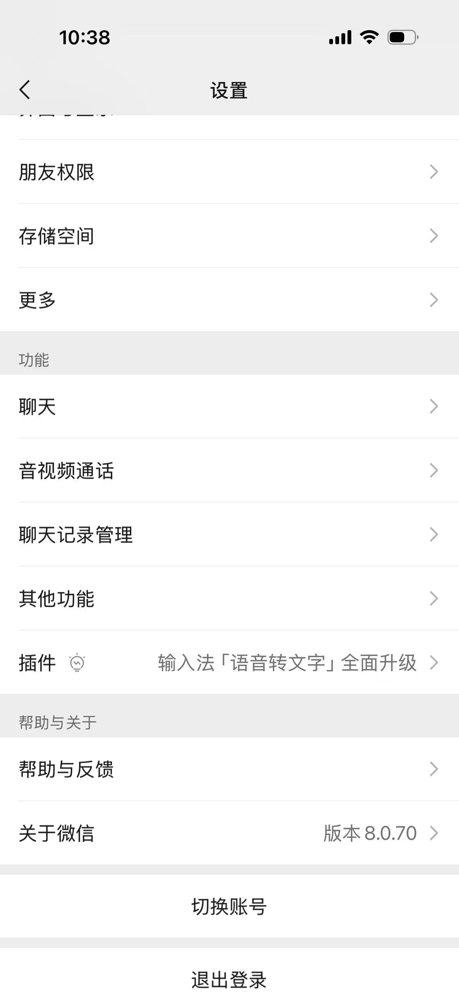
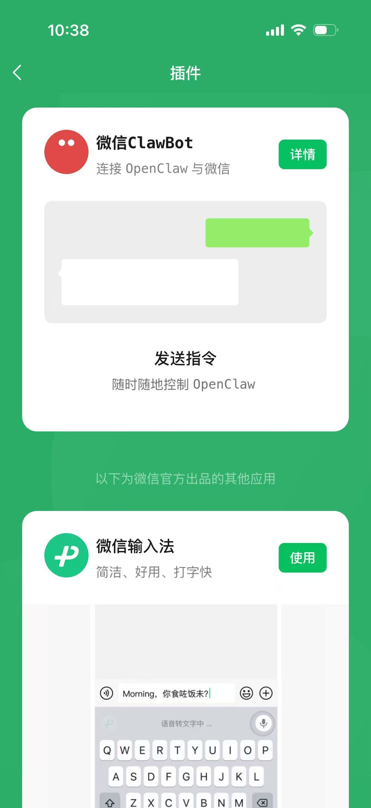
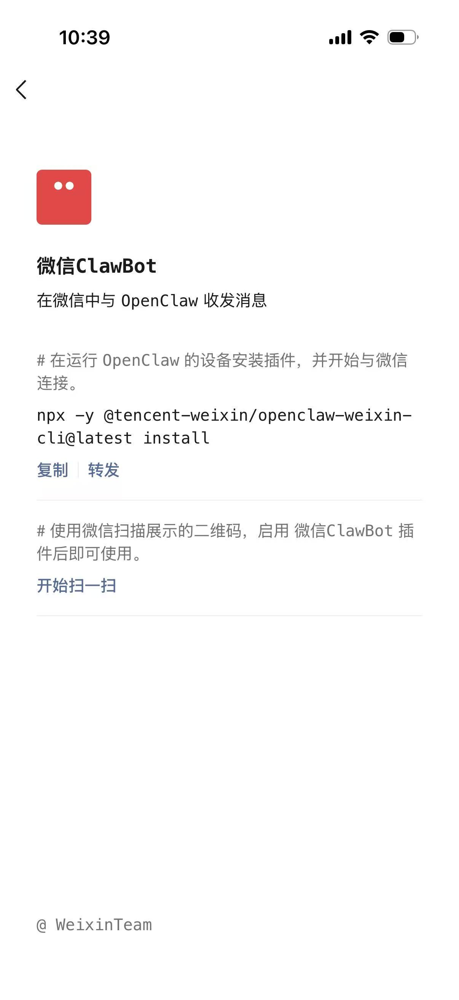
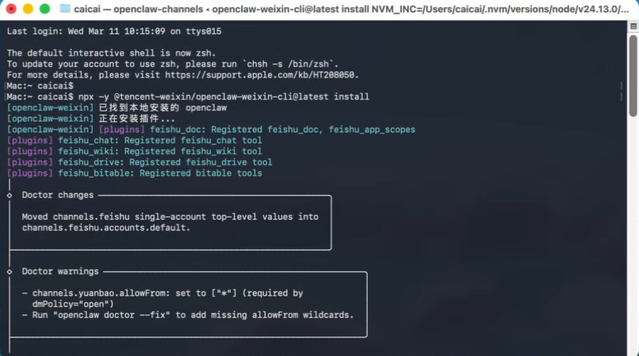
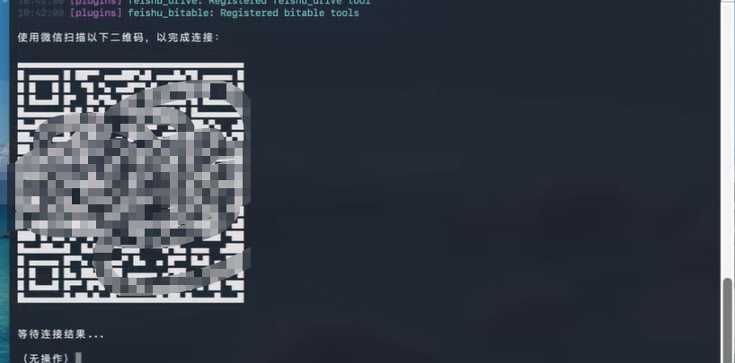
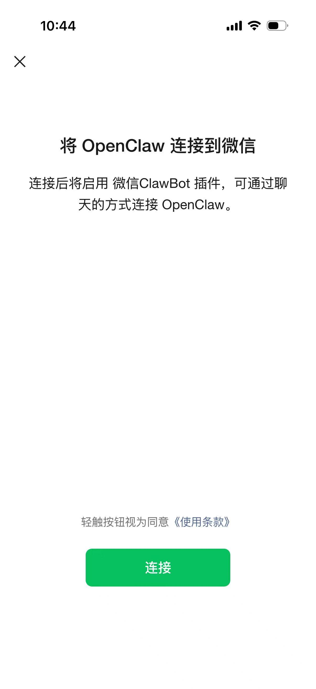
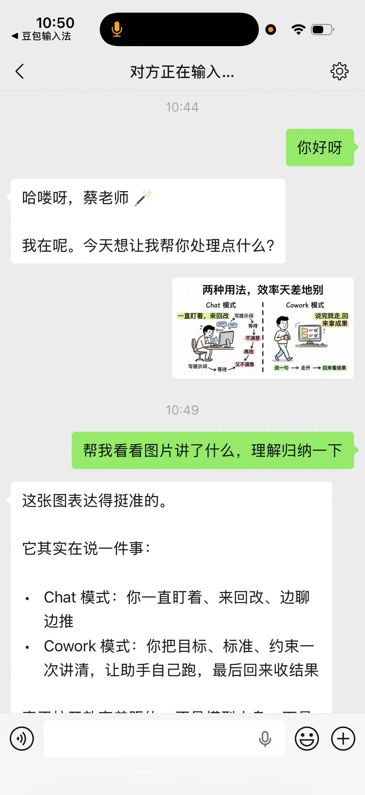
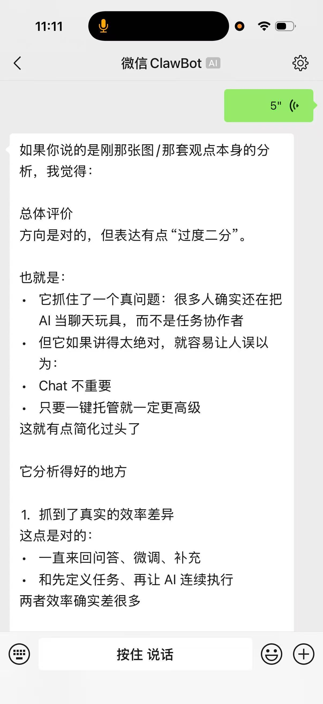

如果你想把 OpenClaw 接到个人微信里，这篇可以直接照着做。整个流程不复杂，核心就是 3 步：先确认微信版本，再安装 `ClawBot` 插件，最后扫码完成连接。

这套方式走的是微信官方插件链路，不是第三方注入方案。对于想在个人微信里稳定使用小龙虾的人来说，会比非官方接法更省心。

## 开始前先确认

- 你已经把 OpenClaw / 小龙虾装好，并且能在运行它的设备上打开终端
- 你当前登录的是自己的个人微信
- 本文里“图 1”到“图 8”的顺序，分别对应图片文件 `w_1` 到 `w_8`

## 第 1 步：先把微信升级到对应版本

先在微信里进入 `我 -> 设置 -> 关于微信` 检查版本号。按这套接入流程，先确认截图对应的版本是 `8.0.70`，再继续下面的插件安装和扫码步骤。

如果你的微信版本明显更旧，建议先去应用商店更新，再回来继续操作。

## 第 2 步：给小龙虾安装微信插件

先在微信里进入 `我 -> 设置 -> 插件`，找到名为 **微信 ClawBot** 的插件，再点进详情页。图 1 和图 2 对应的就是这段操作路径。





如果你暂时没有看到 `微信 ClawBot`，先把微信彻底退出，再重新打开。通常重新进入插件页后，就能看到插件详情里的安装指引。图 3 对应的就是这个页面。



接着在运行 OpenClaw 的那台设备上打开终端，执行下面这条命令安装插件：

```bash
npx -y @tencent-weixin/openclaw-weixin-cli@latest install
```

命令执行完成后，终端会自动完成插件安装和环境检查。图 4 对应的是安装过程界面。



## 第 3 步：打开微信扫一扫，完成连接

插件安装完成后，终端会自动弹出一个二维码。直接用微信扫一扫即可，这是整个连接流程里最关键的一步。图 5 对应二维码界面。



扫码后，微信里会出现连接确认页。按提示完成授权，看到连接成功，就说明个人微信已经接入完成。图 6 对应确认连接的页面。



## 接入完成后可以怎么用

接通后，你就可以直接在个人微信里和小龙虾聊天，不用再额外切到别的聊天工具。

- 可以像普通聊天一样连续对话
- 可以上传图片，让它做图片理解和归纳
- 可以用语音方式交流

如果你要用图片识别、图片理解这类能力，记得把模型切到支持视觉理解的版本，例如 `kimi-k2.5` 这一类模型。图 7 和图 8 分别对应图片理解和语音交流的实际效果。





## 最容易卡住的几个地方

### 1. 微信版本没更新到位

先确认版本号，再做后面的安装和扫码。老版本界面可能和截图不一致。

### 2. 插件页里看不到 ClawBot

先把微信完全退出，再重新打开，一般就能刷新出插件入口。

### 3. 命令没在运行 OpenClaw 的设备上执行

二维码是由运行 OpenClaw 的终端生成的，所以这条命令要在那台设备上执行，不要跑错机器。

### 4. 模型不支持视觉理解

能发图不代表模型一定看得懂。想要稳定用图片理解，记得切到支持视觉的模型。

## 一句话总结

这篇教程的核心就一句话：更新微信，装好 `微信 ClawBot`，扫终端二维码完成授权。接通以后，你就可以直接在个人微信里稳定使用自己的小龙虾了。
